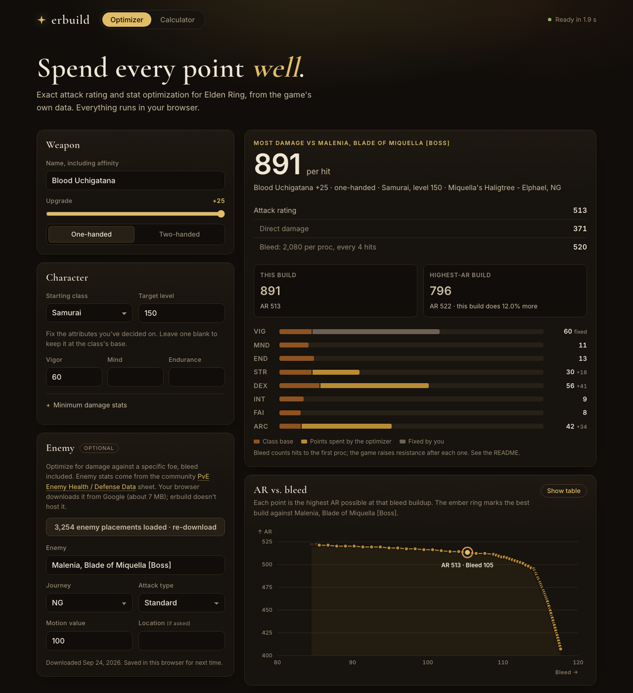

# erbuild

**Find the stat allocation that maximizes your weapon's damage in Elden Ring.**

[](https://github.com/johnboerchers/erbuild/actions/workflows/tests.yml)

[](LICENSE)

Pick a starting class, a target level, a weapon, and the stats you've already
committed to (Vigor, Mind, Endurance…). erbuild works out exactly how to spend the
rest of your points:

- **Exact attack rating** from the game's own datamined parameters, not letter grades.
  It matches a widely used reference calculator on 3,000 randomized cases.
- **A provably optimal allocation**, found with dynamic programming, plus the full
  trade-off between AR and bleed (or other arcane buildup).
- **Damage against a specific enemy:** defenses, damage negation and bleed procs
  for any of 3,254 enemy placements, from NG to NG+7.

Use it from the command line, as a Python library, or in a web app that runs
entirely in your browser.



## Contents

- [Install](#install)
- [Quick start](#quick-start): [command line](#command-line) ·
  [against an enemy](#against-a-specific-enemy) · [Python](#python) ·
  [in the browser](#in-the-browser)
- [How it works](#how-it-works): [attack rating](#1-attack-rating) ·
  [the optimization problem](#2-the-optimization-problem) ·
  [solving it](#3-solving-it) · [damage against an enemy](#4-damage-against-an-enemy)
- [Validation](#validation)
- [Game data](#game-data)
- [Credits and license](#credits-and-license)

## Install

```bash
git clone https://github.com/johnboerchers/erbuild.git
cd erbuild
pip install -e .
```

Requires Python 3.10+ and NumPy.

## Quick start

### Command line

Find the best allocation for a build:

```console
$ erbuild optimize "Blood Uchigatana" --class samurai --level 150 --vig 60
Blood Uchigatana +25 (one-handed) [vanilla-v1.17]
  Samurai, level 150 | fixed VIG 60

Highest AR: 522
  VIG 60  MND 11  END 13  STR 51  DEX 59  INT 9  FAI 8  ARC 18  (0 free points)

AR vs. bleed: 82 Pareto-optimal builds, showing 12 (--all for every one)
    AR    Bleed  STR  DEX  INT  FAI  ARC  Free
   522       84   51   59    9    8   18     0
   521       85   45   58    9    8   25     0
   518       94   38   57    9    8   33     0
   514      102   31   57    9    8   40     0
   509      109   25   56    9    8   47     0
   502      112   18   55    9    8   55     0
   ...
   407      117   12   17    9    8   99     0
```

Each row is the best AR you can have at that much bleed buildup, so you can see what
each extra point of bleed costs. Here, going from 84 to 109 bleed costs 13 AR, but
the last 5 points of bleed cost about 95.

| Option | Effect |
|---|---|
| `--vig 60`, `--mnd 20`, … | Fix any attribute at an exact value |
| `--min mnd=20` | Require an attribute to be *at least* a value (repeatable) |
| `--min-buildup 110` | Pick the highest-AR build with at least that much buildup |
| `--two-handing`, `--upgrade N` | Set the grip and upgrade level |

Points that wouldn't raise AR are left unassigned and shown as *free points*: put them
wherever you like.

To compute AR for a specific set of stats instead:

```console
$ erbuild search uchigatana
Uchigatana                               Katana               +25  req: STR 11 DEX 15
Cold Uchigatana                          Katana               +25  req: STR 11 DEX 15
...

$ erbuild ar "Blood Uchigatana" --str 12 --dex 40 --arc 50
Blood Uchigatana +25 (one-handed) [vanilla-v1.17]
  Attributes: STR 12  DEX 40  INT 10  FAI 10  ARC 50
  Scaling:    STR C  DEX B  ARC D

  Physical       445
  Total          445

  Bleed          110  (buildup)
```

Weapon names include the affinity (`"Heavy Claymore"`, `"Blood Uchigatana"`). If you
misspell one, erbuild suggests close matches. `erbuild classes` lists the starting
classes and their base stats.

### Against a specific enemy

AR is what the equipment screen shows. Against a real enemy, defenses, damage
negation and bleed resistance change which build is best. Download the enemy data
once, then add `--enemy`:

```console
$ erbuild enemies update
$ erbuild enemies search malenia
Malenia, Goddess of Rot [Boss]                       18,473 HP   Miquella's Haligtree - Elphael
Malenia, Blade of Miquella [Boss]                    18,473 HP   Miquella's Haligtree - Elphael

$ erbuild optimize "Blood Uchigatana" --class samurai --level 150 --vig 60 \
    --enemy "Malenia, Blade of Miquella [Boss]"
Blood Uchigatana +25 (one-handed) [vanilla-v1.17]
  Samurai, level 150 | fixed VIG 60
  vs Malenia, Blade of Miquella [Boss] (Miquella's Haligtree - Elphael, NG) | MV 100, standard attack

Most damage per hit: 891
  VIG 60  MND 11  END 13  STR 30  DEX 56  INT 9  FAI 8  ARC 42  (0 free points)
  AR 513 | direct 371 + bleed 520 (2080 per proc, every 4 hits)

For comparison, the highest-AR build: 796 per hit (the build above does 12.0% more)
  VIG 60  MND 11  END 13  STR 51  DEX 59  INT 9  FAI 8  ARC 18  (0 free points)
  AR 522 | direct 380 + bleed 416 (2080 per proc, every 5 hits)
```

The best build against Malenia gives up 9 AR to reach her bleed threshold in 4 hits
instead of 5. AR alone can't show you that.

| Option | Effect |
|---|---|
| `--cycle ng+2` | Journey, NG through NG+7 |
| `--location "castle"` | Pick a placement when an enemy appears in several places |
| `--variant 2` | Pick one of several placements with different stats in the same location (erbuild lists them when it's needed) |
| `--attack-type slash` | Physical attack type: `standard`, `strike`, `slash` or `pierce` (enemies defend against each separately) |
| `--mv 130` | The attack's motion value (default 100, the weapon's full AR) |
| `--bleed-flat 200` | Override the flat part of a bleed proc |

These options also work with `erbuild ar` to score a single build.
`erbuild enemies show "Mohg, Lord of Blood [Boss]"` prints an enemy's HP, defenses,
negations and resistances.

### Python

```python
import numpy as np
from erbuild import load_default, attack_rating, attack_power, optimize

reg = load_default()
katana = reg.get("Blood Uchigatana")

result = optimize(katana, "samurai", 150, fixed={"vig": 60}, minimum={"mnd": 20})
print(result.best.attributes, result.best.ar)
for build in result.frontier:          # Pareto frontier of AR vs. bleed
    print(build.ar, build.status, build.free_points)
build = result.with_status_at_least(110)

from erbuild import load_enemies, optimize_vs_enemy   # after `erbuild enemies update`

malenia = load_enemies().get("Malenia, Blade of Miquella [Boss]", cycle=0)
vs = optimize_vs_enemy(katana, "samurai", 150, malenia, fixed={"vig": 60}, attack_type="slash")
print(vs.best.build.attributes, vs.best.damage.total, vs.best.damage.hits_to_proc)

ar = attack_rating(katana, {"str": 12, "dex": 40, "arc": 50}, upgrade=25)
print(ar.displayed)        # per-type AR as shown in game
print(ar.displayed_total)

# Vectorized: evaluate thousands of stat allocations in one call
dex = np.arange(15, 100)
values = attack_power(katana, {"str": 12, "dex": dex, "arc": 50}, upgrade=25)
```

### In the browser

[`web/`](web/) is a static web app that runs erbuild in your browser through
[Pyodide](https://pyodide.org). It uses the same Python code as the CLI, with no
server. It has the optimizer with an interactive AR-vs-bleed chart, the AR
calculator, and damage against enemies, and a link to the page reproduces the exact
build. See [web/README.md](web/README.md) to run it locally.

## How it works

### 1. Attack rating

For every attack power type $t$ (physical, magic, fire, lightning, holy, plus status
buildup like bleed), a weapon at upgrade level $u$ has

```math
\mathrm{AR}_t = B_t(u)\left(1 + \sum_{s} m_{t,s}\, S_s(u)\, g_t(a_s)\right)
```

| Symbol | Meaning | Game param |
|---|---|---|
| $B_t(u)$ | base attack at upgrade $u$ | `EquipParamWeapon` × `ReinforceParamWeapon` |
| $S_s(u)$ | scaling coefficient for attribute $s$ (the letter grade is a bin of this) | same |
| $m_{t,s}$ | 1 if type $t$ scales with attribute $s$ | `AttackElementCorrectParam` |
| $g_t(x)$ | piecewise "soft cap" curve, 0 at 1 and about 1 at the hard cap | `CalcCorrectGraph` |
| $a_s$ | your attribute value (STR is $\lfloor 1.5 \cdot \mathrm{STR} \rfloor$ when two-handing) | – |

A few details matter for exact results:

- **Unmet requirements:** if any attribute that type $t$ scales with is below the
  requirement, that type's AR becomes $0.6\,B_t(u)$ with no scaling.
- **Two-handing:** raises effective STR for both the requirement check and damage
  scaling, but *not* for status buildup. Paired weapons never get the bonus, and bows
  always do.
- **Display:** the game truncates each type to an integer. The total is the truncated
  sum of the unrounded values.

### 2. The optimization problem

Let $x \in \mathbb{Z}^8$ be the final attributes (VIG, MND, END, STR, DEX, INT, FAI,
ARC). Every starting class satisfies level $= \sum_i x_i - 79$, so a target level $L$
fixes the total number of points. Each attribute has a lower bound $\ell_i$ (the
class's base, raised by any minimum you set) and an upper bound $u_i$ (99, or equal
to $\ell_i$ when you fix it). The problem is

```math
\begin{aligned}
\max_{x \in \mathbb{Z}^8} \quad & f(x) = \sum_{t \in \text{damage types}} \mathrm{AR}_t(x) \\
\text{subject to} \quad & \ell_i \le x_i \le u_i \quad \text{for every attribute } i, \\
& \textstyle\sum_i x_i \le L + 79.
\end{aligned}
```

The budget is an inequality because $f$ never decreases when you add a point, so
nothing is lost by leaving points unspent. Unspent points are the *free points* in
the output. The objective is the unrounded AR; the displayed value is only used for
printing.

Only STR, DEX, INT, FAI and ARC appear in $f$, so the problem reduces to five
variables with $N = L + 79 - \sum_i \ell_i$ points to spend above the lower bounds.

**Status buildup.** Bleed, poison, madness and sleep scale with raw arcane alone, so
a build's buildup is a function of $x_{\mathrm{ARC}}$. Rather than folding buildup
into $f$ with an arbitrary weight, erbuild returns the **Pareto frontier**: for each
arcane value, the highest AR possible, keeping only builds that no other build beats
on both AR and buildup.

### 3. Solving it

**The problem is nearly separable.** Once you fix which requirements are met, AR is a
constant plus one lookup table per attribute, $f(y) = C + \sum_s h_s(y_s)$. Maximizing
a sum of per-attribute tables under a point budget is a *nonlinear integer knapsack*,
which dynamic programming solves exactly. With $V_k(n)$ the best AR from the first $k$
attributes using at most $n$ points:

```math
V_k(n) = \max_{0 \le y \le n} \big[\, h_k(y) + V_{k-1}(n - y) \,\big]
```

Three more properties shape how erbuild uses it:

1. **One DP gives the whole frontier.** Run the DP over STR, DEX, INT and FAI only.
   The best AR at arcane value $a$ is then a single lookup:
   $\mathrm{AR}(a) = C + h_{\mathrm{arc}}(a) + V(N - a)$.
2. **Requirements are the only coupling.** A requirement you don't meet removes a
   type's scaling from *every* attribute. erbuild tries each combination of
   requirements met or unmet (at most $2^5 = 32$), restricts each attribute to the
   matching side of its requirement, and keeps the best. So it will leave a
   requirement unmet when that's genuinely better.
3. **It isn't concave.** Soft-cap curves start out convex, requirements create
   cliffs, and two-handed STR moves in uneven steps. That's why the simple approach
   of adding each point where it helps most can get stuck on a worse build, and
   why erbuild uses the DP.

Ties go to the allocation that spends the fewest points. The whole optimization takes
a few milliseconds.

### 4. Damage against an enemy

For each damage type, the game compares your attack to the enemy's defense with the
attack ratio $r = \mathrm{AR}_t \cdot \mathrm{MV} / \mathrm{Def}_t$ and applies a
piecewise curve $m(r)$, from 10% at low ratios up to 90% at $r \ge 8$
([details](https://eldenring.wiki.fextralife.com/Calculating+Damage)):

| $r$ | $m(r)$ |
|---|---|
| < 0.125 | 0.10 |
| 0.125 – 1 | 0.10 + (r − 0.125)² / 2.552 |
| 1 – 2.5 | 0.70 − (2.5 − r)² / 7.5 |
| 2.5 – 8 | 0.90 − (8 − r)² / 151.25 |
| ≥ 8 | 0.90 |

Damage per hit sums each type through the curve and the enemy's negation, then adds
bleed averaged over the hits it takes to proc:

```math
f_{\text{enemy}}(x) = \sum_{t} \mathrm{MV} \cdot \mathrm{AR}_t(x) \cdot m(r_t) \cdot (1 - \text{neg}_t)
\;+\; \frac{\beta\,(0.15\,\mathrm{HP} + F)}{\big\lceil R / \mathrm{buildup}(x) \big\rceil}
```

Here $R$ is the enemy's bleed resistance and $\beta$ its incoming bleed multiplier
(0.7 for most base-game bosses, 0.5 for Mohg and most DLC bosses). The flat part $F$
is 200 for Reduvia, Morgott's Cursed Sword, Varre's Bouquet, Hoslow's Petal Whip and
Blood-infused weapons with innate bleed, and 100 otherwise
([source](https://eldenring.wiki.fextralife.com/Hemorrhage)). Physical damage uses
the enemy's defense and negation for the attack's physical type.

**Reading the bleed term.** Bleed adds nothing to the hits that fill the meter; the
whole proc lands on the hit that fills it. erbuild spreads that proc over the cycle of
hits it takes, which gives the *average* damage per hit. For the Blood Uchigatana
build against Malenia above, each hit does 371 direct damage and bleed procs for
2,080 on every 4th hit:

| Hit | Direct | Bleed | Actual damage |
|---|---:|---:|---:|
| 1 | 371 | 0 | 371 |
| 2 | 371 | 0 | 371 |
| 3 | 371 | 0 | 371 |
| 4 | 371 | 2,080 | 2,451 |
| **Per 4 hits** | **1,484** | **2,080** | **3,564** |

$3{,}564 / 4 = 891$ per hit, reported as 371 direct plus $2{,}080 / 4 = 520$ bleed. No
single hit does 891; it's the rate over a repeating cycle, which is what matters for
sustained damage, since total damage ≈ hits landed × damage per hit. The ceiling in
$\lceil R / \mathrm{buildup} \rceil$ is there because a proc needs whole hits. This is
also why the optimizer will trade some AR for bleed: cutting the cycle from 5 hits to
4 raises bleed from a fifth of a proc per hit to a quarter (416 → 520 against
Malenia), which outweighs losing 9 AR.

**Solving it.** For a weapon with one damage type, like Blood Uchigatana, the best
build against *any* enemy lies on the AR-vs-buildup frontier from section 2. For a
fixed arcane value, bleed is fixed and damage rises with AR, and a build beaten on
both AR and buildup can't do more damage. So erbuild just scores the frontier builds.
With split damage (for example physical and fire), each type passes through the
defense curve separately, and damage is no longer a function of total AR. erbuild then
enumerates every allocation of the attributes that matter. Because damage never drops
when you add a point, it only has to check allocations that spend the whole budget.

#### Simplifications

Bleed is modeled more simply than the game handles it. Keep these in mind:

- **Bleed is an average, not a hit-by-hit simulation.** In a short fight, bleed may
  never proc at all: if an enemy dies in 3 hits, the 4-hit cycle above never
  completes, and maximizing direct damage would be the better choice.
- **Resistance rises after each proc.** The game raises an enemy's threshold after
  every proc, via `ResistanceCorrectParam` (for one common profile: ×1.3, ×1.77,
  ×2.44, ×4.0, then ×8.6). The enemy data doesn't say which profile each enemy uses,
  so erbuild uses the **first** proc's cycle length throughout. Over a long fight this
  overstates bleed, and so can favor arcane more than it should.
- **Buildup decay** between hits is ignored.
- **Every hit applies the weapon's full buildup.** Some moves apply more or less.
- **Only bleed is counted as damage.** In the game, poison and scarlet rot also
  damage enemies over time, and frost deals burst damage and makes the target take
  more damage. erbuild's enemy mode doesn't model these yet, so builds that rely on
  them are undervalued against enemies.
- **Motion value and attack type are inputs.** They depend on the move, and the
  default (MV 100, standard) is a reasonable baseline, not a specific attack.

## Validation

- **Attack rating:** `tests/fixtures/reference_ar.json` holds 3,000 randomized cases
  (random weapon, stats, upgrade level and grip, biased toward requirement thresholds
  and soft caps) computed by
  [Tom Clark's calculator](https://github.com/ThomasJClark/elden-ring-weapon-calculator),
  a widely used tool known to match in-game values. erbuild matches every case to
  floating-point precision.
- **Optimizer:** checked against brute-force enumeration of every allocation on 200
  random cases (weapons, classes, levels, grips, fixed and minimum attributes, with
  small budgets so enumeration is feasible). It must find the same best AR for every
  arcane value, spend the same minimum number of points, and return the same frontier.
- **Enemy damage:** checked the same way on 120 random cases with randomized enemies
  (defenses, negations, HP, bleed resistance, immunity), for both the frontier
  shortcut and full enumeration. Tests never download the real enemy data; they use a
  small synthetic workbook in the same format.

```bash
pip install -e ".[dev]"
pytest
```

**In-game checks wanted!** `tests/fixtures/ingame_ar.csv` is for values read straight
off the equipment screen. If you add rows from your own save (and note the patch),
please open a pull request.

## Game data

**Weapons.** The bundled weapon data is vanilla v1.17. Game patches change weapon
params; to add a newer version:

```bash
python scripts/fetch_regulation.py vanilla-v1.18
erbuild --data src/erbuild/data/regulation-vanilla-v1.18.json ar "Uchigatana" --dex 40
```

**Enemies.** Enemy stats come from the community
[Elden Ring PvE Enemy Health / Defense Data](https://docs.google.com/spreadsheets/d/1BVwmKqB8pvuyJkSTGYOM2kAJxFMQ0jVsc6aKYz_Upes/edit)
sheet. It covers 3,254 enemy placements for every journey from NG to NG+7, derived
from the game's params with each placement's area scaling applied. The sheet has no
stated license, so erbuild **doesn't include it**. `erbuild enemies update` downloads
it on your machine and saves a converted copy to `~/.cache/erbuild/enemies.json` (or
`$ERBUILD_CACHE`, or `--enemy-data PATH`). The web app downloads it straight from
Google in your browser. All credit for the data goes to the sheet's authors.

## Credits and license

MIT. Regulation data and the core formula are derived from
[elden-ring-weapon-calculator](https://github.com/ThomasJClark/elden-ring-weapon-calculator)
by Tom Clark (MIT). See [THIRD_PARTY_NOTICES.md](THIRD_PARTY_NOTICES.md).

Enemy data is not included; see [Game data](#game-data).

Elden Ring is a trademark of FromSoftware / Bandai Namco. This is an unofficial fan
project.
